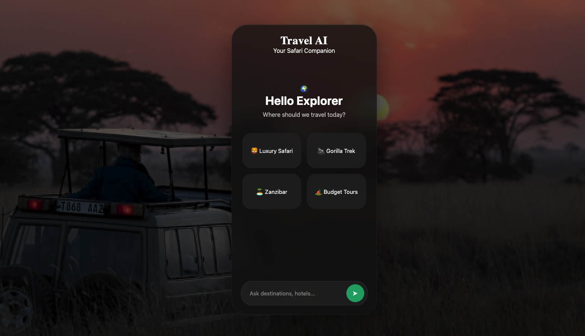

# Travel Africa AI

This is a RAG (Retrieval-Augmented Generation) travel assistant that helps users discover African safari tours using semantic search and AI-generated responses.

## Features

- CSV data ingestion and cleaning.
- ChromaDB vector database.
- Search safari tours using natural language.
- Retrieves the most relevant tour information using vector embeddings.
- FastAPI backend.
- Generates AI-powered answers based on retrieved context.
- Interactive chat interface.



## Project Architecture

```text
CSV Dataset

      │

      ▼

Data Cleaning

      │

      ▼

Text Chunking

      │

      ▼

Embedding Generation

      │

      ▼

ChromaDB

      │

      ▼

Semantic Search

      │

      ▼

Groq LLM

      │

      ▼

Frontend Chat UI
```

## Tech Stack

### Backend

- Python
- FastAPI

### AI

- Sentence Transformers
- ChromaDB
- Groq API
- RAG

### Frontend

- HTML
- CSS
- JavaScript

### Data

- Pandas
- CSV

## 📂 Project Structure

```text
TravelAfricaRAGProject/
│
├── app/
│ ├── main.py
│ ├── rag.py
│ ├── scraper.py
│ └── vectorstore.py
│
├── data/
│
├── frontend/
│
├── requirements.txt
│
└── README.md
```

## ⚙️ Installation

```bash
git clone https://github.com/quotlant/TravelAfricaRAGProject

cd TravelAfricaRAGProject

python -m venv venv

source venv/bin/activate
```

## Install dependencies

```bash
pip install -r requirements.txt
```

## RUN the API

```bash
uvicorn app.main:app --reload
```

## Run the Frontend

Open `frontend/index.html` in your browser.

## Why this project

This project explores Retrieval-Augmented Generation (RAG) by combining semantic search with large language models to answer travel-related questions. It demonstrates how structured travel data can be transformed into an intelligent assistant capable of retrieving relevant safari tours and generating context-aware responses.
